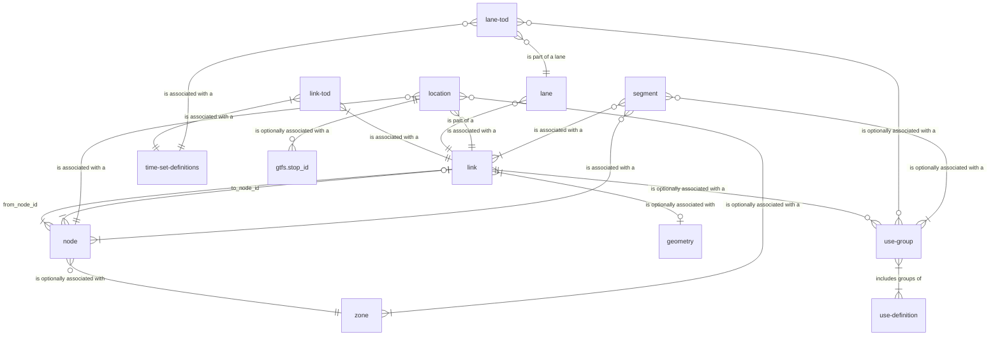
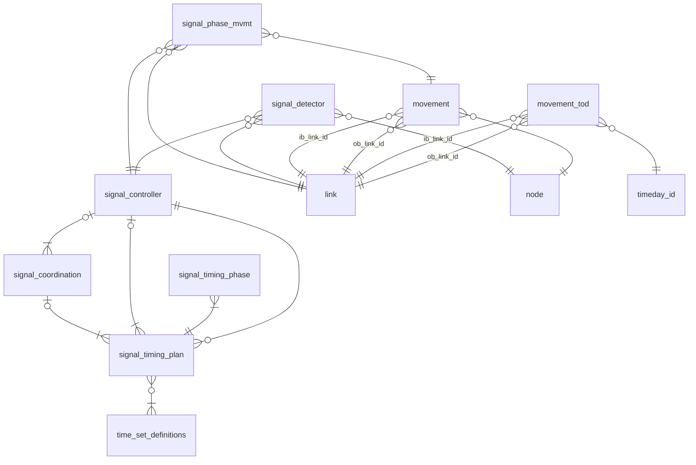

# General Architecture of GMNS

```mermaid
erDiagram
    link |o--|{ node : from_node_id
    link |o--|{ node : to_node_id
    link }|--o| geometry : "is optionally associated with"
    link ||--o{ use-group : "is optionally associated with a"
    link-tod }|--|| link : "is associated with a"
    link-tod }|--|| time-set-definitions : "is associated with a"
    node }o--|| zone : "is optionally associated with"
    lane }o--|| link : "is part of a"
    lane-tod }o--|| lane : "is part of a lane"
    lane-tod }o--|| time-set-definitions : "is associated with a"
    lane-tod }o--o{ use-group : "is optionally associated with a"
    location }o--|| link : "is associated with a"
    location }o--|| node : "is associated with a"
    location }o--|{ zone : "is optionally associated with a"
    location ||--o{ "gtfs.stop_id" : "is optionally associated with a"
    segment }o--|{ link : "is associated with a"
    segment }o--|{ node : "is associated with a"
    segment }o--|{ use-group : "is optionally associated with a"
    use-group }|--|{ use-definition : "includes groups of"
```

## Signals

```mermaid
erDiagram
    signal_controller |o--|{ signal_coordination : ""
    signal_coordination |o--|{ signal_timing_plan  : ""
    signal_controller |o--|{ signal_timing_plan :""
    signal_phase_mvmt }o--|| signal_controller :""
    signal_phase_mvmt }o--|| movement :""
    signal_phase_mvmt }o--|| link :""
    signal_timing_plan }o--|| signal_controller :""
    signal_timing_plan }o--|{ time_set_definitions :""
    signal_timing_phase }|--|| signal_timing_plan :""
    signal_detector }o--|| link :""
    signal_detector }o--|| node :""
    signal_detector }o--|| signal_controller : ""
    movement }o--|| node :""
    movement }o--|| link : "ib_link_id"
    movement }o--|| link : "ob_link_id"
    movement_tod }o--|| timeday_id : ""
    movement_tod }o--|| link : ib_link_id
    movement_tod }o--|| link : ob_link_id
```
