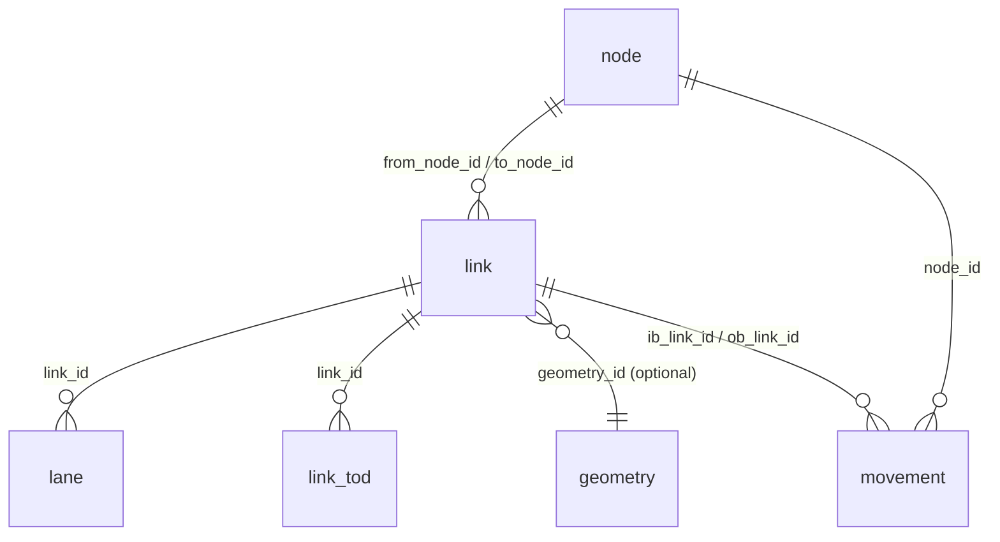

# What is GMNS?

## What it is

The **General Modeling Network Specification (GMNS)** is an open standard, maintained by the [Zephyr Foundation](https://zephyrtransport.org/), for representing routable transportation networks as a small set of related tables. The spec lives at [github.com/zephyr-data-specs/GMNS](https://github.com/zephyr-data-specs/GMNS) and is versioned (current vendored versions: 0.95, 0.96, 0.97).

A GMNS network is a directory of CSVs (or Parquet, or any tabular store) plus a `datapackage.json` manifest that describes the schema. The required core is just two tables:

* `link` — directed edges of the routable graph (one row per road segment between two intersections).
* `node` — vertices of the graph (intersections, dead-ends, zone centroids).

Layered on top of that core, the spec defines optional tables for the things real transportation models need:

* **Geometry detail** — `geometry` (WKT shapes per link), `segment` and `segment_lane` (sub-link partitioning for places where lane geometry changes).
* **Lane detail** — `lane` (one row per travel lane), `movement` (turning movements at a node).
* **Time-of-day overrides** — `link_tod`, `lane_tod`, `segment_tod`, `segment_lane_tod`, `movement_tod` — per-period overrides on capacity, allowed uses, lane assignments.
* **Signal control** — `signal_controller`, `signal_coordination`, `signal_detector`, `signal_phase_mvmt`, `signal_timing_phase`, `signal_timing_plan`.
* **Demand context** — `zone` (traffic analysis zones), `location` (curb-side points), `curb_seg` (curb space management).
* **Dimension tables** — `time_set_definitions` (period definitions), `use_definition` and `use_group` (vehicle / mode classes), `config` (network-wide configuration).

The full set across the 0.97 spec is **25 resource files**. See [Table of tables](reference/table-of-tables.md) for the catalog and [Schema reference](reference/spec.md) for field-level detail.

The spec ships as a [Frictionless Data Package](https://specs.frictionlessdata.io/data-package/) — `datapackage.json` declares each resource, its CSV schema, primary keys, and foreign-key relationships in a machine-readable form.

## Why we have it

Before GMNS, every traffic simulator, travel-demand model, and routing engine carried its own network format. A network exported from Cube didn't load in TransCAD; a Visum file didn't open in SUMO; a TomTom routing graph wasn't a TransModeler input. Modelers spent more time writing conversion scripts than running models, and every conversion silently dropped information.

GMNS exists so a network produced for one tool travels to another with **zero conversion code**. The interop story is the whole story:

1. Producers (state DOTs, MPOs, OSM derivative pipelines) publish in GMNS.
2. Consumers (modelers, routing services, analysis tools) read GMNS directly.
3. The spec is small enough that bespoke conversions are practical when a tool *doesn't* speak GMNS natively — but the goal is that they don't have to be written twice.

GMNS is **not** a modeling format with semantics baked in (capacity calculations, BPR functions, signal optimisation). It is the *substrate* on which those tools operate. The same GMNS network feeds a microsimulation, a static-equilibrium assignment, and an active-transportation accessibility analysis.

## Mental model

* **Tables, not files** — a GMNS network is a set of relations, not a binary blob. Any tabular store works (CSV, Parquet, DuckDB, zipped CSV).
* **Two required tables, the rest optional** — the minimum viable GMNS network is `link` + `node`. Every other table layers detail onto that spine.
* **Foreign keys are the API** — relationships between tables (`lane.link_id` → `link.link_id`, `link.from_node_id` → `node.node_id`) are declared in `datapackage.json` and machine-checkable.

The core relationships:

A real network has more edges in this diagram (signal tables hang off `node`, segment tables sub-divide `link`, zone tables hang off `node`) but the four cardinal relations above carry most of the routing semantics.

## How it relates to ...

### The Frictionless Data Package format

GMNS is a Frictionless Data Package. The spec is not a custom serialization — it's a `datapackage.json` that declares 25 resources, each with a Table Schema (field types, constraints, primary key, foreign keys). Any Frictionless-compatible reader can parse a GMNS package's structure without knowing what GMNS is.

This is why the GMNSpy validator's structural and schema passes are inherited verbatim from `datagrove` (the generic toolkit underneath); only the foreign-key chains and the data-quality rules are GMNS-specific.

### GTFS

[GTFS](https://gtfs.org/) (General Transit Feed Specification) is a separate spec, scoped to **scheduled public transit** — routes, stops, trips, stop-times. GMNS is scoped to the **routable roadway / street network** — links, nodes, lanes, signals.

The two are complementary and frequently combined: GMNS for the street network the bus drives on, GTFS for the bus schedule. Bridging tools like [openmobilitydata.org](https://openmobilitydata.org) and the in-development GTFS-GMNS reconciliation patterns let a transit assignment use both.

GMNS deliberately does not duplicate GTFS. A `transit_route` table is *not* in GMNS — that's GTFS's job.

### OpenStreetMap

[OpenStreetMap (OSM)](https://www.openstreetmap.org/) is a global, crowdsourced geographic database. It is **not** a network spec — OSM tags are loose, regionally inconsistent, and not designed for routing-grade modeling out of the box.

GMNS is the standardised target for the conversion. Tools like [`osm2gmns`](https://github.com/jiawlu/OSM2GMNS) and `osmnx` (used to build the bundled Leavenworth fixture — see its [README](https://github.com/e-lo/GMNSpy/blob/refactor/v1.0/packages/gmnspy/gmnspy/fixtures/leavenworth/README.md)) consume OSM, infer link attributes (lanes, free-flow speed, facility type) from OSM tags, and emit GMNS.

OSM → GMNS is lossy and opinionated (tag inference is heuristic; OSM doesn't carry signal timing or TOD restrictions). The point is that the *output* is a single standardised format that every downstream consumer understands, regardless of where the source data came from.

## See also

* [Quickstart](quickstart.md) — install and load the bundled fixture in five minutes.
* [Visual tour](visual-tour.md) — see Leavenworth rendered as a map, validated, edited, and scoped.
* [Table of tables](reference/table-of-tables.md) — catalog of every GMNS resource.
* [Schema reference](reference/spec.md) — field-level reference for the vendored spec.
* [Architecture](../shared/architecture.md) — design rationale for the toolkit on top of GMNS.
