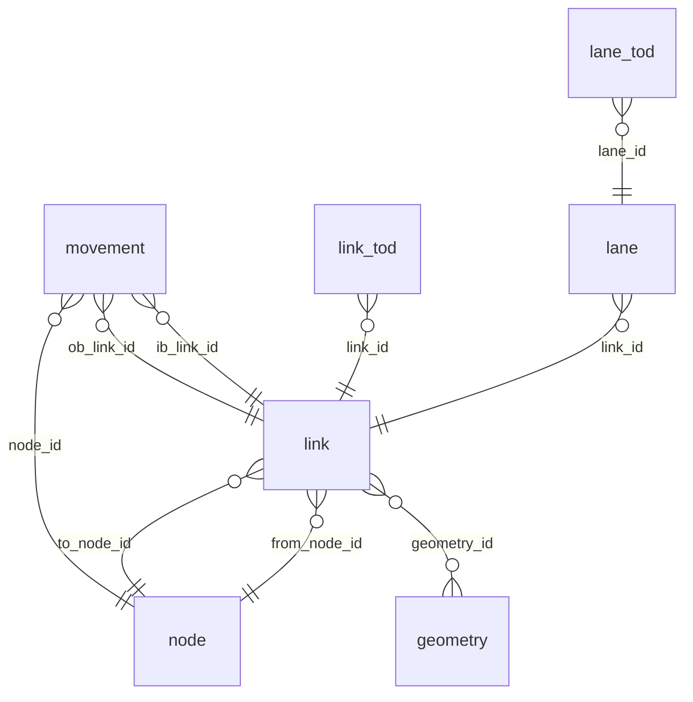

# Table of tables

!!! info "Stub — to be filled in Wave 4"
    This page is scaffolded. The content fill is tracked in [issue #96](https://github.com/e-lo/GMNSpy/issues/96) and follows the [Page Style Guide](../_page-style-guide.md).

## Summary

GMNS defines ~25 resource files. Two are always required (`link`, `node`); the rest layer on optional detail. This page lists every one with a one-paragraph purpose + the FK graph.

## Required

| Table | Purpose | Foreign keys |
|---|---|---|
| `link` | Edges of the routable graph. | `from_node_id`, `to_node_id` → `node.node_id`; `geometry_id` → `geometry.geometry_id` (optional) |
| `node` | Vertices of the routable graph. | `zone_id` → `zone.zone_id` (optional) |

## Detail tables

(Lane, segment, segment_lane, link_tod, lane_tod, segment_tod, segment_lane_tod, movement, movement_tod, zone, location, curb_seg.)

## Signal-control tables

(signal_controller, signal_coordination, signal_detector, signal_phase_mvmt, signal_timing_phase, signal_timing_plan.)

## Dimension tables

(time_set_definitions, use_definition, use_group, config.)

## ER diagram

## See also

* [Schema reference](spec.md) — auto-generated field-level reference.
* [What is GMNS?](../intro/what-is-gmns.md) — design context.
