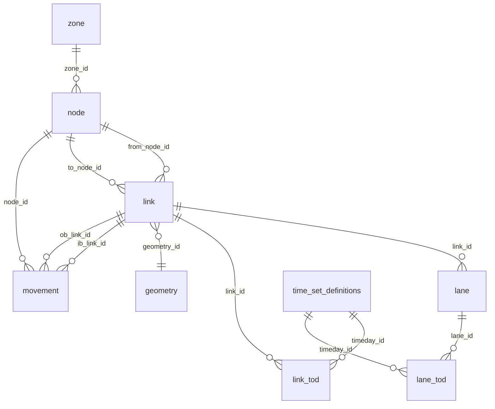

# Table of tables

## Summary

GMNS 0.97 defines **25 resource files** grouped into four families: required, detail, signal-control, and dimension. Two tables (`link`, `node`) are required by the spec; the rest layer optional detail. This page is the "which table should I use?" entry point. For field-level detail (types, constraints, descriptions per column) see [Schema reference](spec.md).

The vendored 0.97 spec lives at `packages/gmnspy/gmnspy/spec/0.97/`. Each table is defined by a `<name>.schema.json` and listed as a resource in `datapackage.json`.

## Required

These two tables form the routable graph spine. A valid GMNS package must include both.

| Table | Purpose | Key foreign keys |
|---|---|---|
| `link` | Directed edges of the routable graph; one row per road segment between two intersections. Carries facility type, lane count, free-flow speed, allowed uses. | `from_node_id`, `to_node_id` → `node.node_id`; `geometry_id` → `geometry.geometry_id` (optional); `parent_link_id` → `link.link_id` (self-ref, optional) |
| `node` | Vertices of the routable graph; intersections, dead-ends, zone centroids. Carries x/y coordinates and control type. | `zone_id` → `zone.zone_id` (optional); `parent_node_id` → `node.node_id` (self-ref, optional) |

## Detail tables

Add geometric, lane-level, segment-level, or curb-level detail to the link/node spine. All optional.

| Table | Purpose | Key foreign keys |
|---|---|---|
| `lane` | One row per travel lane on a link. Carries lane number, width, allowed uses, turn restrictions. | `link_id` → `link.link_id` |
| `segment` | Sub-divides a link where attributes change mid-link (e.g., a lane drop). One row per segment. | `link_id` → `link.link_id` |
| `segment_lane` | One row per lane within a segment. Same role as `lane` but at segment granularity. | `segment_id` → `segment.segment_id` |
| `link_tod` | Time-of-day override on link attributes (capacity, allowed uses) for a defined period. | `link_id` → `link.link_id`; `timeday_id` → `time_set_definitions.timeday_id` |
| `lane_tod` | Time-of-day override on lane attributes. | `lane_id` → `lane.lane_id`; `timeday_id` → `time_set_definitions.timeday_id` |
| `segment_tod` | Time-of-day override on segment attributes. | `segment_id` → `segment.segment_id`; `timeday_id` → `time_set_definitions.timeday_id` |
| `segment_lane_tod` | Time-of-day override on segment-lane attributes. | `segment_lane_id` → `segment_lane.segment_lane_id`; `timeday_id` → `time_set_definitions.timeday_id` |
| `movement` | A turning movement at a node, from an inbound link to an outbound link. Carries permitted uses and a movement type (left/through/right/u-turn). | `node_id` → `node.node_id`; `ib_link_id`, `ob_link_id` → `link.link_id` |
| `movement_tod` | Time-of-day override on movement attributes. | `mvmt_id` → `movement.mvmt_id`; `timeday_id` → `time_set_definitions.timeday_id` |
| `geometry` | WKT LineString per link. Referenced by `link.geometry_id`; optional (links can be implicit straight from-to). | (primary key; referenced by `link`) |
| `zone` | Traffic analysis zone (TAZ) polygons or centroids for demand modeling. | (primary key; referenced by `node.zone_id`) |
| `location` | Curb-side point of interest — a stop, a pick-up location, a service door. | `link_id` → `link.link_id` (optional); `zone_id` → `zone.zone_id` (optional) |
| `curb_seg` | A managed curb segment with allowed uses, parking regulations, loading-zone designations. | `link_id` → `link.link_id` |

## Signal-control tables

Carry signalized-intersection timing and detection data. All optional; needed only when modeling signal operations.

| Table | Purpose | Key foreign keys |
|---|---|---|
| `signal_controller` | One row per signal controller (typically one per signalized intersection). | `node_id` → `node.node_id` |
| `signal_coordination` | Coordination relationships between controllers in a corridor. | `controller_id` → `signal_controller.controller_id` |
| `signal_detector` | Detector loops / video zones on link approaches. | `controller_id` → `signal_controller.controller_id`; `link_id` → `link.link_id` |
| `signal_phase_mvmt` | Maps movements to signal phases (which phase serves which turning movement). | `controller_id` → `signal_controller.controller_id`; `mvmt_id` → `movement.mvmt_id` |
| `signal_timing_phase` | Per-phase timing parameters (min green, max green, yellow, all-red). | `timing_plan_id` → `signal_timing_plan.timing_plan_id` |
| `signal_timing_plan` | A named timing plan (cycle length, offset, plan identifier) for one controller. | `controller_id` → `signal_controller.controller_id`; `timeday_id` → `time_set_definitions.timeday_id` (when plan is TOD-bound) |

## Dimension tables

Vocabularies and configuration referenced by the detail and signal-control tables. All optional but typically present when any TOD or use-restriction is used.

| Table | Purpose | Key foreign keys |
|---|---|---|
| `time_set_definitions` | Named time periods (e.g., `weekday_am_peak` = Mon-Fri 07:00-09:00). Referenced by every `*_tod` table. | (primary key) |
| `use_definition` | A defined vehicle / mode class (auto, truck, transit, bike, walk). | (primary key; referenced by `use_group`, `lane.allowed_uses`, etc.) |
| `use_group` | A named set of `use_definition` members (e.g., `motorized` = {auto, truck, transit}). | `use_id` → `use_definition.use_id` |
| `config` | Network-wide configuration key/value pairs (units, default CRS, GMNS version metadata). | (primary key) |

## ER diagram

The core link / node / lane / link_tod / movement / geometry relationships:

The signal, segment, and curb tables hang off `link` and `node` with the same shape but aren't shown here to keep the diagram readable. For the complete table list see the families above; for individual field detail see [Schema reference](spec.md).

## See also

* [Schema reference](spec.md) — auto-generated field-level reference per table.
* [What is GMNS?](../intro/what-is-gmns.md) — design context for the spec.
* [Visual tour](../intro/visual-tour.md) — see several of these tables rendered in a notebook.
* [Glossary](glossary.md) — GMNS terms used above (TOD, segment, movement, …).
