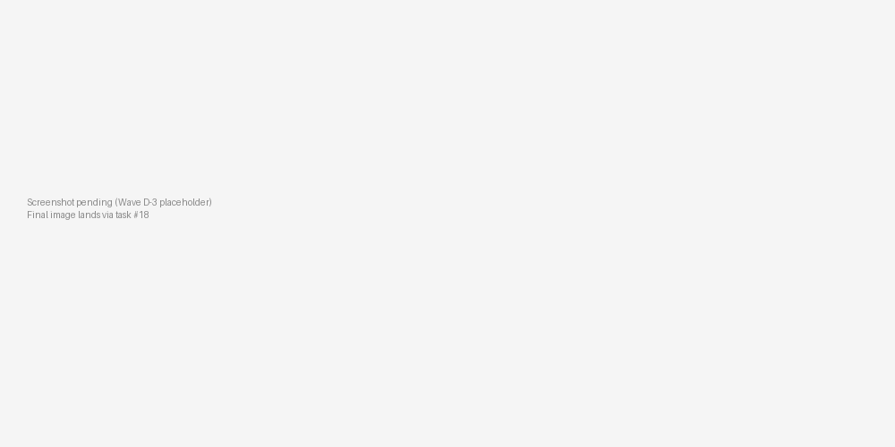

# Wire the MCP server to Claude Code / Claude Desktop

## When to use this

You want an AI agent (Claude Desktop, Claude Code, any MCP-aware host) to call `netstead` directly via tool calls — describe a package, run validation, scope a subgraph, run the quality pack — instead of you copying CLI output into the chat. The MCP server speaks the Model Context Protocol so the agent treats `netstead` as a first-class tool surface.

## Quick example

Add this entry to your MCP host config, restart the host, and ask the agent "describe the package at /tmp/leavenworth/csv". The agent picks `describe_package`, calls it with `{"source": "/tmp/leavenworth/csv"}`, and surfaces the spec version, table counts, and FK summary back in chat:

```json
{
  "mcpServers": {
    "netstead": {
      "command": "netstead",
      "args": ["mcp", "serve"]
    }
  }
}
```

{ .screenshot }
*Claude Desktop invoking the netstead MCP server — tool name, arguments, and the JSON response inline in the chat.*

## Step-by-step

### 1. Install

The `[mcp]` extra brings in `mcp` (the official Python SDK). If you've already installed `[clean]` or `[server]`, only the MCP SDK is added:

```bash
pip install 'netstead[mcp]'
```

### 2. Test the server runs

You don't normally launch the server yourself — the MCP host does it. But `--help` confirms the entry point resolves and the SDK is importable:

```bash
netstead mcp serve --help
```

Expected:

```text
Usage: netstead mcp serve [OPTIONS]

  Start the netstead MCP server (stdio transport).
  ...
```

### 3. Configure the MCP host

**Claude Desktop (macOS):** edit `~/Library/Application Support/Claude/claude_desktop_config.json`. On Linux it's `~/.config/Claude/claude_desktop_config.json`; on Windows, `%APPDATA%\Claude\claude_desktop_config.json`. Restart Claude Desktop after editing; the tools show up under a hammer-icon in the chat input:

```json
{
  "mcpServers": {
    "netstead": {
      "command": "netstead",
      "args": ["mcp", "serve"]
    }
  }
}
```

**Claude Code:** add `.mcp.json` to the root of your project. Claude Code picks it up on session start. To use the version installed in a project venv, replace `command` with the absolute path to that venv's `netstead`:

```json
{
  "mcpServers": {
    "netstead": {
      "command": "netstead",
      "args": ["mcp", "serve"]
    }
  }
}
```

### 4. The tools shipped today

The server exposes 7 stateless tools. Each takes a JSON object and returns a JSON document. Sources are paths or URLs that `Network.from_source` accepts:

| Name | Summary | Inputs | Output |
|---|---|---|---|
| `describe_package` | Spec version, table list, row counts, FK summary. | `source: str` | `{spec_version, tables: [{name, rows, columns}], fk_summary}` |
| `validate_package` | Run all four validation passes; return the report. | `source: str`, optional `passes: [str]` | `{passed: bool, issues: [Issue]}` |
| `list_tables` | Names + row counts only (cheaper than `describe_package`). | `source: str` | `{tables: [{name, rows}]}` |
| `describe_network` | GMNS-aware variant of `describe_package` — adds graph stats. | `source: str` | `{spec_version, tables, components, nodes_in_largest_cc}` |
| `quality_check` | Run the data-quality rule pack. | `source: str`, optional `rules: [str]` | `{issues: [Issue]}` |
| `connected_components` | Count + size distribution of weakly-connected components. | `source: str` | `{count, sizes: [int]}` |
| `scope_from_nodes` | Build a node-seeded scope and return the scoped network's summary. | `source: str`, `node_ids: [int]`, optional `network_buffer: str` | `{tables: [{name, rows}], seed_nodes: [int]}` |

### 5. Sample agent prompts

Each of these exercises a different tool — paste them into a chat with the server configured to see the agent pick the right call:

* **"What's in the package at `packages/netstead/netstead/fixtures/leavenworth/csv`?"** — agent calls `describe_package`, returns spec version + per-table rowcounts.
* **"Validate that package and tell me about any ERROR-severity issues."** — agent calls `validate_package`, filters the response, and surfaces just the failures.
* **"Build a 500m scope around nodes 1, 5, and 12 in that package and tell me how many links it has."** — agent calls `scope_from_nodes` with `node_ids=[1,5,12]` and `network_buffer="500m"`.

## Common variations

???+ note "Default — stdio transport, system netstead"
    The simplest config: relies on `netstead` being on the MCP host's `PATH`.

    ```json
    {
      "mcpServers": {
        "netstead": { "command": "netstead", "args": ["mcp", "serve"] }
      }
    }
    ```

??? note "Rename the server in the host UI"
    `--name` becomes the label under the tool list in Claude.

    ```json
    "args": ["mcp", "serve", "--name", "gmns-leavenworth"]
    ```

??? note "Run inside a project venv"
    Use the absolute path to that venv's `netstead` binary; avoids version skew with the system install.

    ```json
    {
      "mcpServers": {
        "netstead": {
          "command": "/path/to/.venv/bin/netstead",
          "args": ["mcp", "serve"]
        }
      }
    }
    ```

??? note "Pin the server to a working directory"
    Adds `cwd` so all relative-path tool calls resolve from a known root.

    ```json
    {
      "mcpServers": {
        "netstead": {
          "command": "netstead",
          "args": ["mcp", "serve"],
          "cwd": "/abs/path/to/data"
        }
      }
    }
    ```

??? note "Pass env vars (cloud creds)"
    Use `env` to inject credentials into the subprocess.

    ```json
    {
      "mcpServers": {
        "netstead": {
          "command": "netstead",
          "args": ["mcp", "serve"],
          "env": { "AWS_PROFILE": "ds-readonly" }
        }
      }
    }
    ```

## Pitfalls

* **Stdio transport only today.** The HTTP MCP transport is a follow-up — track the [open issues](https://github.com/e-lo/netstead/issues?q=mcp) for progress. For now, every agent that wants to call netstead needs to launch its own subprocess.
* **Tools are stateless.** There's no persistent `edit_session` tool yet — every call is a one-shot load + read. The agent can't mutate a network and inspect intermediate state across calls. See the [issue tracker](https://github.com/e-lo/netstead/issues?q=mcp) for the design discussion.
* **JSON-only return values.** Tool outputs are valid JSON, not pickles or DataFrames. Large tables come back paginated / summarised — for full data, the agent should call the CLI directly via a shell tool.
* **Config file path is case-sensitive on macOS.** `Claude` vs `claude` matters. If the server doesn't show up after a restart, check `~/Library/Logs/Claude/mcp*.log`.

## See also

* [Architecture](https://e-lo.github.io/netstead/corral/architecture/) — MCP server position in the v1.0 surface layering.
* [Drive the CLI from an AI agent loop](https://e-lo.github.io/netstead/corral/ai/json-cli/) — when you want an agent to drive `netstead` via shell instead of MCP.
* [API reference](../reference/api.md) — the Python entry points the MCP tools wrap.
